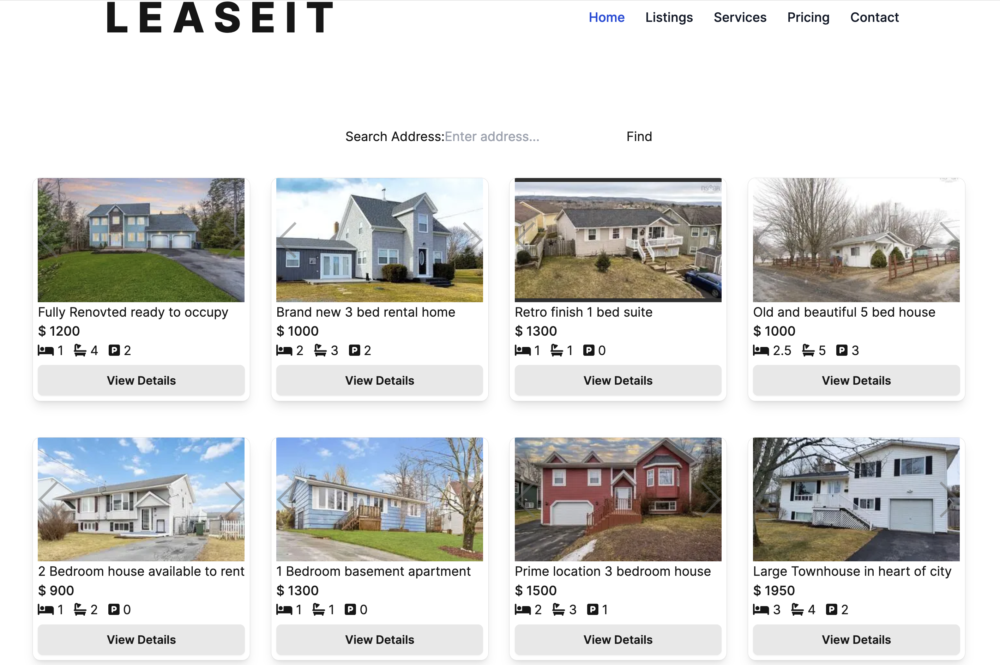

# Rent Webapp

Sampe Rent webapp to help landlords list properties and find tenants. This is a work in progress and will have an API setup where it will get the property info from an API. Currently fetches its data from a payload.json file that depicts the payload structure for the API response

This is a [Next.js](https://nextjs.org/) project bootstrapped with [`create-next-app`](https://github.com/vercel/next.js/tree/canary/packages/create-next-app).
CSS: Custom and Tailwind



## Getting Started

First, run the development server:

```bash
npm run dev
# or
yarn dev
# or
pnpm dev
# or
bun dev
```
